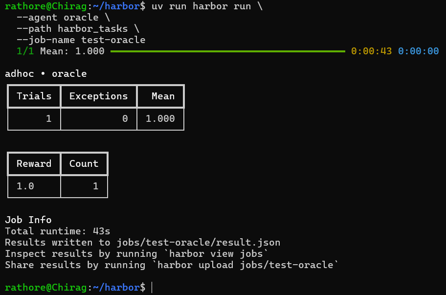
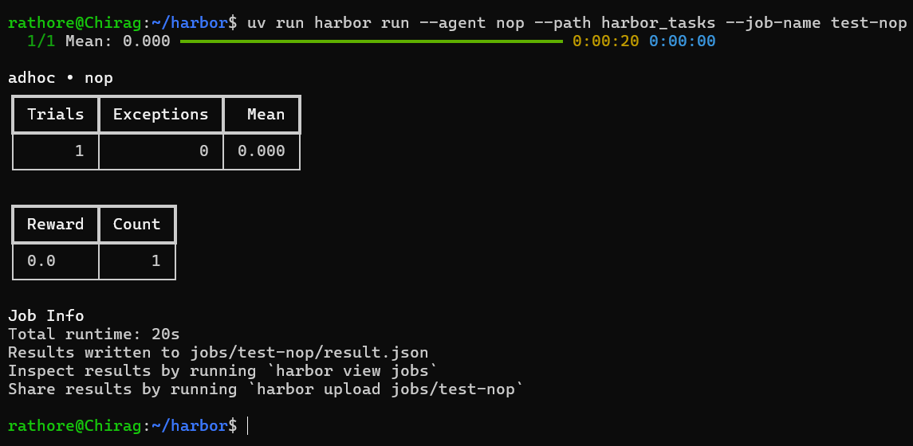

# Harbor Task – Chirag Singh Rathore

## Overview

This repository contains a custom Harbor task developed as part of the Harbor task assignment.

The task is designed to evaluate an agent's ability to complete the specified objective within the provided environment. It follows the standard Harbor task structure and includes the environment, instructions, solution, tests, and configuration required for evaluation.

---

## Repository Structure

```text
harbor_tasks/
├── environment/
├── instruction.md
├── solution/
├── task.toml
└── tests/
```

---

## Prerequisites

* Python 3.11+
* Docker Desktop (running)
* WSL2 (if using Windows)
* `uv`
* Harbor

---

## How to Run

### 1. Clone the repository

```bash
git clone <repository-url>
cd <repository-name>
```

### 2. Install dependencies

```bash
uv sync
```

### 3. Run the Oracle agent

```bash
uv run harbor run \
    --agent oracle \
    --path harbor_tasks \
    --job-name test-oracle
```

### 4. Run the NOP agent

```bash
uv run harbor run \
    --agent nop \
    --path harbor_tasks \
    --job-name test-nop
```

### 5. Run Ruff linting

```bash
ruff check .
```

---

# Results

## Oracle Evaluation

**Expected Score:** `1.0`



---

## NOP Evaluation

**Expected Score:** `0.0`



---

## Ruff Lint

Expected result:

```text
All checks passed!
```


---

# Task Summary

* ✅ Custom Harbor task implemented
* ✅ Oracle evaluation passes (1.0)
* ✅ NOP evaluation passes (0.0)
* ✅ Ruff lint passes
* ✅ Repository contains complete task implementation

---

## Notes

This task follows the Harbor task structure and can be executed using the Harbor CLI with the Oracle and NOP agents for evaluation.
